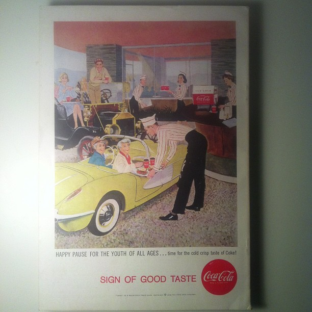
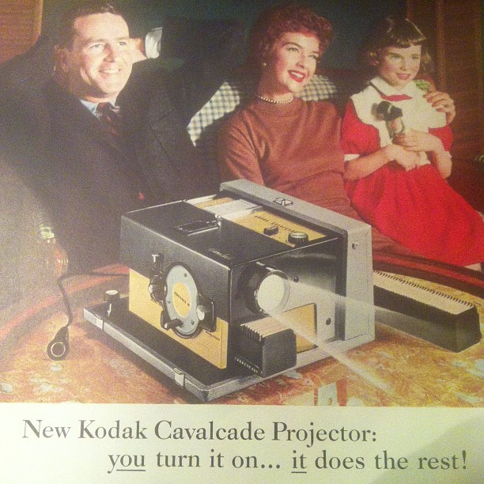
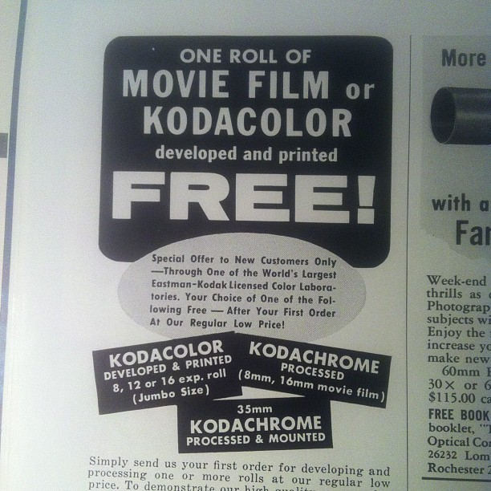
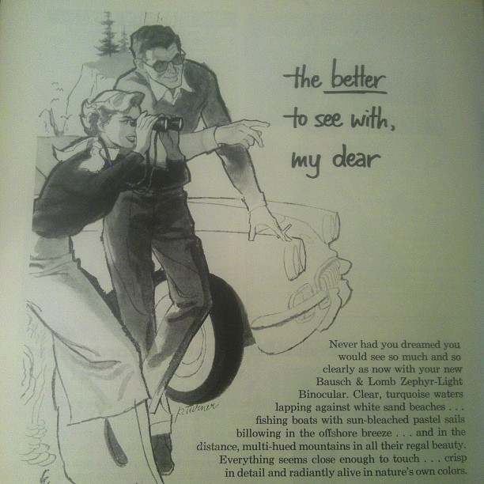

title: National Geographic CXIV - Volumes 2-4, 1958
abstract: Some snaps from the three editions of National Geographic I picked up on Etsy and which scratch my mid-century itch as well as just being lovely to look at.
author: Stuart Frisby
date: 2012-10-24 15:00
ds: October 24
dss: Oct 24
template: article.jade
comments: off

I couldn't resist these when I saw them on the [Etsy](http://etsy.com) store of [Peony & Thistle](http://www.etsy.com/shop/peonyandthistle?ref=seller_info). They're full of glorious mid-century design, the covers alone are wonderful, and the advertising inside is like going for a wander around the set of Mad Men.

I've found myself leaning on Magazine's more and more for inspiration of late. [Monocle](http://monocle.com) was a great source of ideas when I was reworking this website, and [Off Screen](http://offscreenmag.com) manages to inspire me to be a better design whilst letting me read about designers. These old editions of National Geographic will join those other titles in providing something pretty and well designed to enjoy in those few hours a day when I'm not staring at a screen. 

